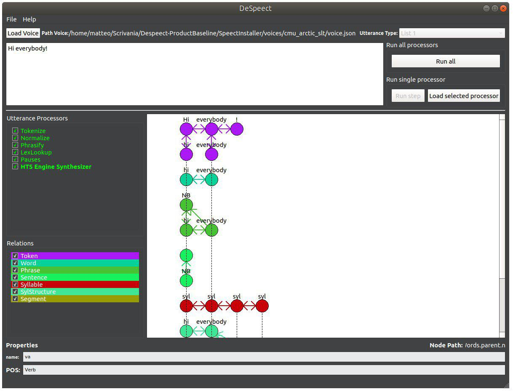

# Despeect

https://sonarcloud.io/api/project_badges/measure?project=DeSpeect_Official_Build&metric=alert_status

A GUI and debugging tool for the Speect TTS library.

## Introduction

### What is DeSpeect?

DeSpeect is a graphical interface for Speect [Meraka Institute (2008-2013)], a library for the creation of vocal synthesis systems, which facilitates the inspection of its internal state during its execution and the writing of tests for its functionality.

### References

* [Speect docs](http://speect.sourceforge.net/ "Speect docs")
* [Qt docs](http://doc.qt.io/ "Qt docs")
* [Google Test docs](https://github.com/google/googletest/blob/master/googletest/docs/Primer.md "Google Test docs")
* [Speect by Mivoq s.r.l.](https://github.com/mivoq/speect "Mivoq Speect") 

## Getting Started

### Prerequisites

* Unix / Unix-like OS (DeSpeect has only been tested on Ubuntu 16.04 LTS)
* CMAKE (minimum version 2.8)
* ANSI C/ISO C90 GCC compiler (minimum version 5.0)
* Qt 5.9.0

### Installing

In order to intall the application, you need to execute the following steps:

1. Clone or download the repository
2. Execute the `build.sh` script in the root directory

This will install Speect and create a build for DeSpeect in `DeSpeect/build/`

## Running the tests

The tests for DeSpeect are implemented through the Google Test framework and they are run at every build by Travis CI.
Once you have installed the application, you can run the related tests by entering the build directory (`DeSpeect/build/`) and using either the `ctest` or `unit_tests` commands.

## Usage

### Running the application

In order to run the application, you need to execute the following steps:

1. Enter the bin directory through the `DeSpeect/build/bin/` path
2. Start the application executing the `main` file

## Example - Visualizing the graph

In order to visualize a Speect internal graph, you just need to load a `.json` voice file clicking on the `Load Voice`button in the main window (sample voices are stored in the `SpeectInstaller/voices/` directory), and subsequently execute Speect through the `Run All` or `Run Step` button. Notice that `Run All` will execute all the utterance processors, while `Run Step` will only run the first utterance processor (see [Speect docs](http://speect.sourceforge.net/ "Speect docs" for more information). The following is a detailed sample procedure of how to visualize a graph:

1. Start the application
2. Click on the `Load Voice` button
3. Open the file corresponding the `SpeectInstaller/voices/cmu_arctic_slt/voice.json` path
4. Select the desired utterance processors in the homonymous sidebar
5. Click the `Run step` button in order to execute the utterance processors list step by step, or click `Run all` in order to execute the whole list

## Build with

* Qt 5.9 LTS
* CMAKE 2.8
* Speect 1.1.0-69-g65f4
* Ubuntu 16.04 LTS
* Travis CI
